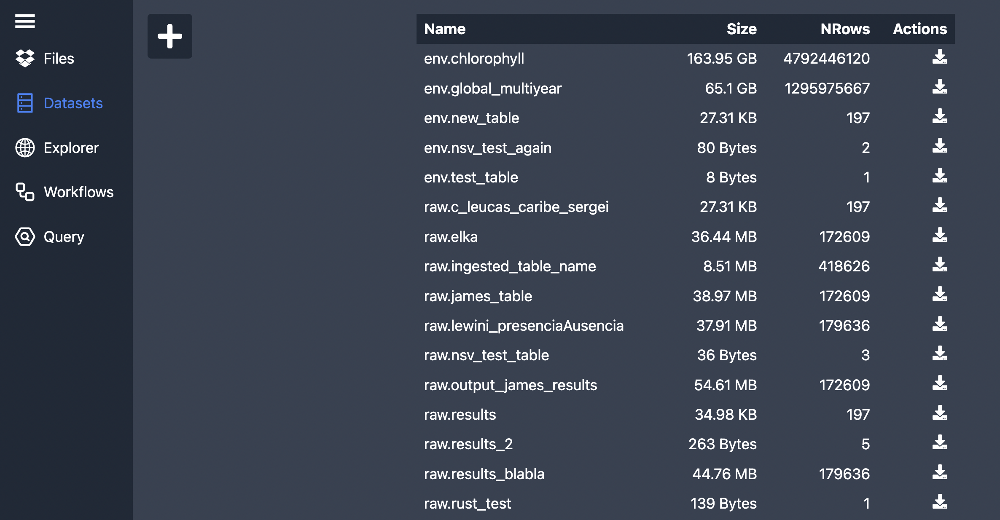
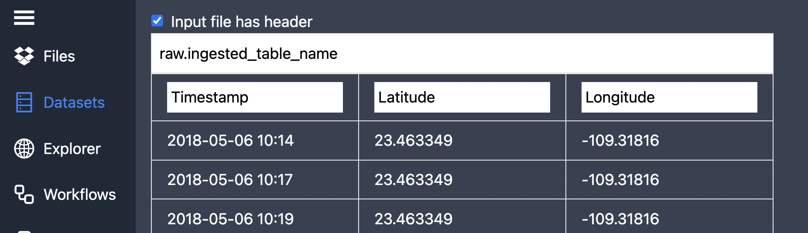
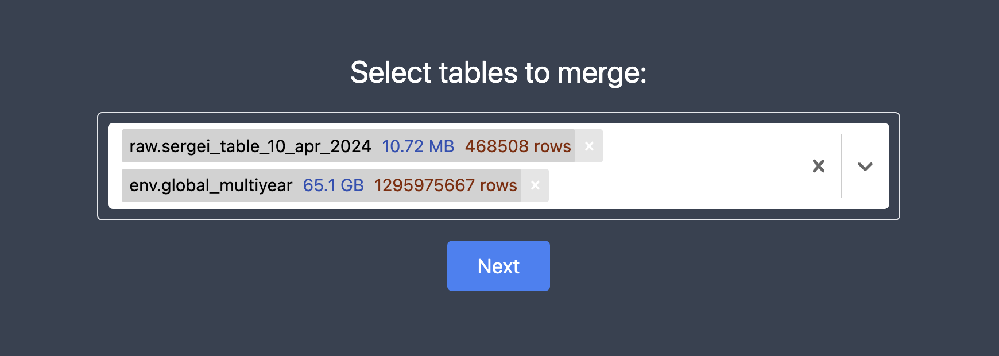
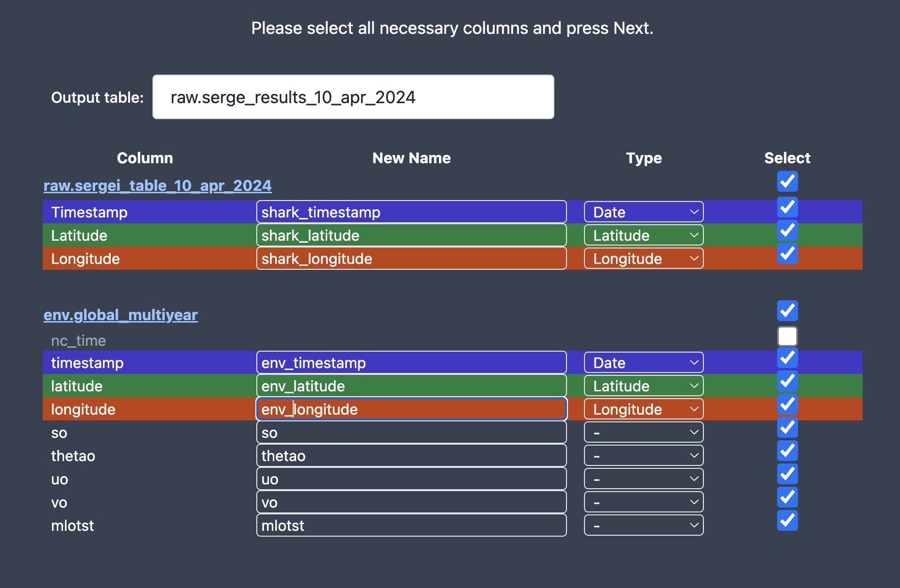
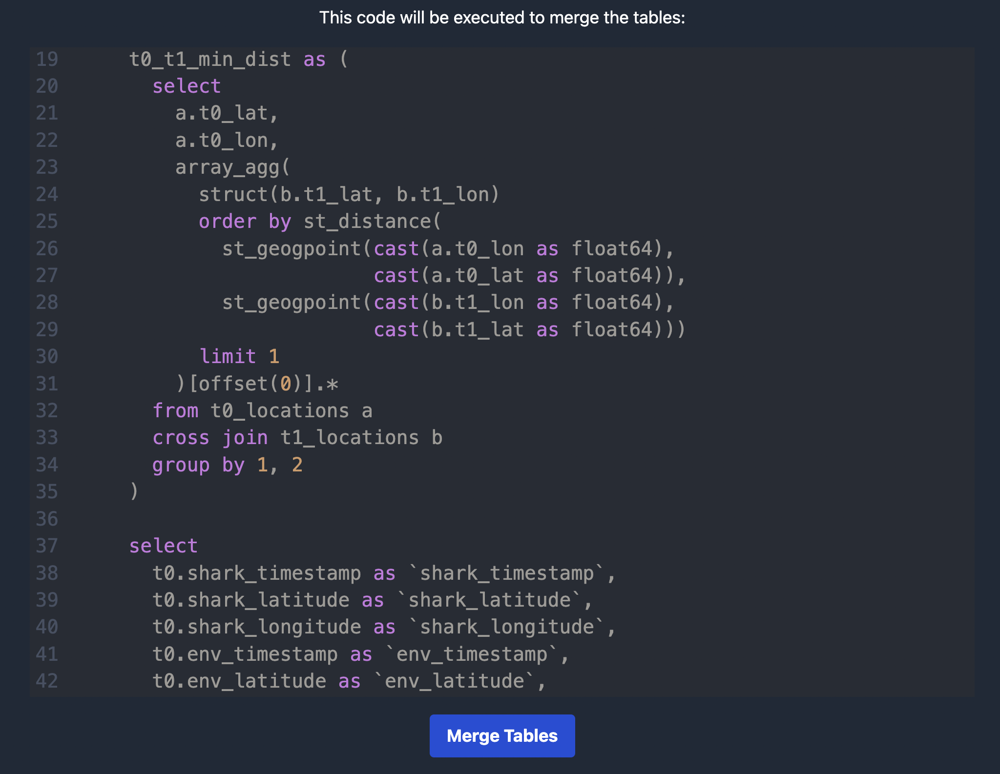

This tutorial shows how to merge your observational with envirounmental data!

:::caution[Note]
This feature is in closed beta, please ask access via [WhatsApp](http://whatsapp.wildflow.ai) or [Discord](http://discord.wildflow.ai).
:::

### Intro

- Observational data (e.g. 30MB of your shark trails) expected to have key columns `latitude`, `longitude` and `date` (and any other non-key columns).
- Envirounmental data (e.g. 100GB of [chlorophyll levels from Copernicus](https://data.marine.copernicus.eu/product/OCEANCOLOUR_GLO_BGC_L4_MY_009_104/description)) expected to have key columns `latitude` and `longitude` (and any other non-key columns).

The output table would have observational data (all the rows) and for each row we find nearest location (geo distance) from envirounmental data.

We use Google BigQuery as an underlying engine to perform this join.

### 1. Upload your observational data to **wildflow**

Make sure you uploaded your observational data file to [Wildflow](https://wildflow-demo.web.app/datasets). You can go to the `Datasets` tab and click on the `+` button and drag and drop your file there.

:::caution[Note]

- For now it only supports `CSV` format.
- It only supports ISO date time (or anything Google BigQuery supports).\
  E.g `2000-10-31 23:30`.
  :::



Please specify the file name and make sure all the columns have correct names. File name should start with `raw.` for now (it's a name of the dataset/collection of tables in BigQuery).



Proceed to upload your table.

### 2. Enable environmental data

If you need your dataset available in **wildflow**, please contact us via [WhatsApp](http://whatsapp.wildflow.ai) or [Discord](http://discord.wildflow.ai).

Please provide us the name of the dataset, e.g.: https://data.marine.copernicus.eu/product/OCEANCOLOUR_GLO_BGC_L4_MY_009_104

### 3. Select tables to merge

Navigate to the [Workflows](https://wildflow-demo.web.app/workflows) tab and select tables you need to join:

- First choose your observational data (e.g. trails of your shark) and then choose large dataset (like chlorophyll levels).

- You can select as many environmental tables as you want.



### 3. Select result columns



- Select only those columns you need.
- Make sure name of each column is unique.
- Specify name of the resulting table.

:::caution[Note]

- Merge will be happening based on the column `Type`
- For now we don't support depth, but it should be easy to add.
  :::

### 4. SQL code

Now you should be able to see the SQL code generated to join these tables:


Feel free to save it for future experiment reproducibility.
You can run this in the Google BigQuery console.

### 5. Merge

When you continue the query will be executed:


You can see most recent jobs here: [Jobs](https://wildflow-demo.web.app/jobs).

And it should finish with a few minutes:


Now you should be able to see a new table with merged observational and environmental data.

Yay! 🐳

### 6. Advanced Users

If you have a timestamp format that is not supported by BigQuery (`06/05/18 10:14` but you need `2018-05-06 10:14`), you can run this adhoc query to create `raw.test_table` from `gs://bucket-name/uploaded/Table_2024-04-10T16:59:21.145Z.csv`.

```sql
load data overwrite raw.test_table (
  Timestamp string,
  Latitude float64,
  Longitude float64
) from files (
  format = 'CSV',
  uris = ['gs://bucket-name/uploaded/Table_2024-04-10T16:59:21.145Z.csv'],
  skip_leading_rows = 1
);

create or replace table raw.test_table as (
  select parse_timestamp('%d/%m/%y %H:%M', Timestamp) as Timestamp,
  Latitude,
  Longitude
  from raw.test_table
);

select * from raw.test_table limit 10
```
